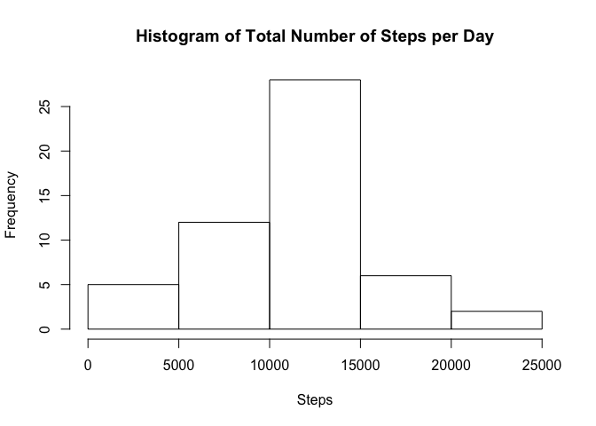
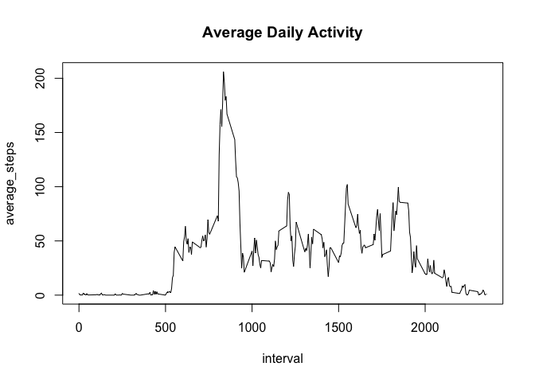
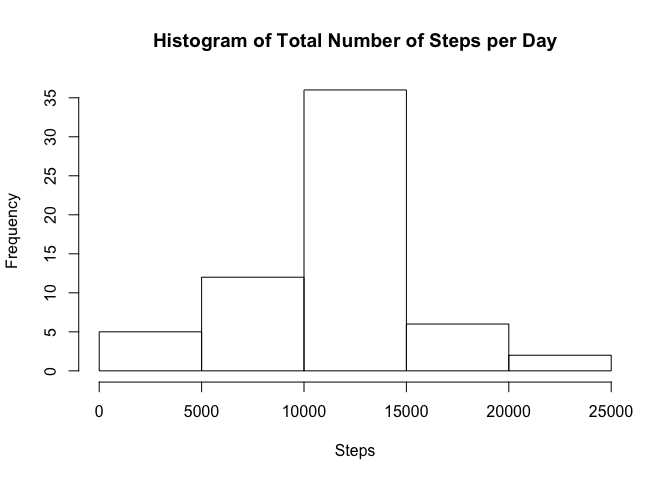
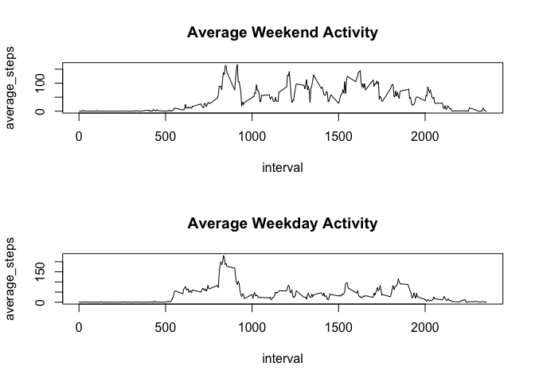

# Reproducible Research: Peer Assessment 1

```r
library(dplyr)
```

```
## 
## Attaching package: 'dplyr'
```

```
## The following objects are masked from 'package:stats':
## 
##     filter, lag
```

```
## The following objects are masked from 'package:base':
## 
##     intersect, setdiff, setequal, union
```

## Loading and preprocessing the data

```r
activity <- read.csv("activity.csv")
activity$date <- as.Date(activity$date, '%Y-%m-%d')
```


## What is mean total number of steps taken per day?

```r
# Calculate the total number of steps taken per day
steps_by_date <- activity %>% group_by(date) %>% summarise(total_steps = sum(steps))
steps_by_date
```

```
## Source: local data frame [61 x 2]
## 
##          date total_steps
##        (date)       (int)
## 1  2012-10-01          NA
## 2  2012-10-02         126
## 3  2012-10-03       11352
## 4  2012-10-04       12116
## 5  2012-10-05       13294
## 6  2012-10-06       15420
## 7  2012-10-07       11015
## 8  2012-10-08          NA
## 9  2012-10-09       12811
## 10 2012-10-10        9900
## ..        ...         ...
```


```r
# Make Histogram
hist(steps_by_date$total_steps, main = "Histogram of Total Number of Steps per Day", xlab = "Steps")
```




```r
# Calculate and report the mean and median of the total number of steps taken per day
ave_steps <- mean(steps_by_date$total_steps, na.rm = TRUE)
med_steps <- median(steps_by_date$total_steps, na.rm = TRUE)
```


```r
paste("Mean: ", ave_steps)
```

```
## [1] "Mean:  10766.1886792453"
```

```r
paste("Median: ", med_steps)
```

```
## [1] "Median:  10765"
```

## What is the average daily activity pattern?

Make a time series plot (i.e. 𝚝𝚢𝚙𝚎 = "𝚕") of the 5-minute interval (x-axis) and the average number of steps taken, averaged across all days (y-axis)


```r
ave_steps_by_int <- activity %>% group_by(interval) %>% summarise(average_steps = mean(steps, na.rm = TRUE))
plot(average_steps ~ interval, data = ave_steps_by_int, type = 'l', main = 'Average Daily Activity')
```



Which 5-minute interval, on average across all the days in the dataset, contains the maximum number of steps?


```r
ave_steps_by_int[which.max(ave_steps_by_int$average_steps), 1]
```

```
## Source: local data frame [1 x 1]
## 
##   interval
##      (int)
## 1      835
```

On average, the most steps are taken at 8:35 am.

## Imputing missing values

Calculate and report the total number of missing values in the dataset.


```r
length(activity$steps[which(is.na(activity$steps))])
```

```
## [1] 2304
```

Devise a strategy for filling in all of the missing values in the dataset. The strategy does not need to be sophisticated.

Use mean of each 5 minute interval.

Create a new dataset that is equal to the original dataset but with the missing data filled in.


```r
imputed_activity <- activity
impute_steps <- function(s, i) {
   if (is.na(s)) {
       # give s the average value of the interval across all days.
       s <- ave_steps_by_int$average_steps[which(i == ave_steps_by_int$interval)]
   }
   return(s)
}
imputed_activity$steps <- mapply(impute_steps, imputed_activity$steps, imputed_activity$interval)
```

Make a histogram of the total number of steps taken each day and Calculate and report the mean and median total number of steps taken per day. Do these values differ from the estimates from the first part of the assignment? What is the impact of imputing missing data on the estimates of the total daily number of steps?


```r
steps_by_date <- imputed_activity %>% group_by(date) %>% summarise(total_steps = sum(steps))
hist(steps_by_date$total_steps, main = "Histogram of Total Number of Steps per Day", xlab = "Steps")
```



```r
ave_steps <- mean(steps_by_date$total_steps)
med_steps <- median(steps_by_date$total_steps)
paste("Mean: ", ave_steps)
```

```
## [1] "Mean:  10766.1886792453"
```

```r
paste("Median: ", med_steps)
```

```
## [1] "Median:  10766.1886792453"
```

The distribution of the total Number of steps per day is now much more concentrated around the mean.

The mean does not change after imputing the values, but the median adjusts to the mean.


## Are there differences in activity patterns between weekdays and weekends?

Create a new factor variable in the dataset with two levels – “weekday” and “weekend” indicating whether a given date is a weekday or weekend day.


```r
label_day <- function(date) {
    if (weekdays(date) %in% c("Sunday", "Saturday")) {
        return("weekend")
    } else {
        return("weekday")
    }
}

imputed_activity$day_type <- as.factor(sapply(imputed_activity$date, FUN = label_day))
```

Make a panel plot containing a time series plot (i.e. 𝚝𝚢𝚙𝚎 = "𝚕") of the 5-minute interval (x-axis) and the average number of steps taken, averaged across all weekday days or weekend days (y-axis).


```r
activity_weekend <- imputed_activity %>%
                      filter(day_type == "weekend") %>%
                      group_by(interval) %>%
                      summarise(average_steps = mean(steps))

activity_weekdays <- imputed_activity %>% 
                      filter(day_type == "weekday") %>%
                      group_by(interval) %>%
                      summarise(average_steps = mean(steps))

par(mfrow=c(2,1))
plot(average_steps ~ interval, data = activity_weekend, type = 'l', main = 'Average Weekend Activity')
plot(average_steps ~ interval, data = activity_weekdays, type = 'l', main = 'Average Weekday Activity')
```



